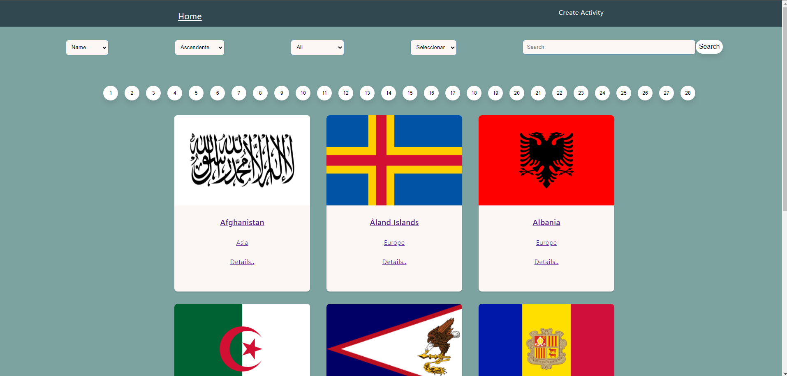
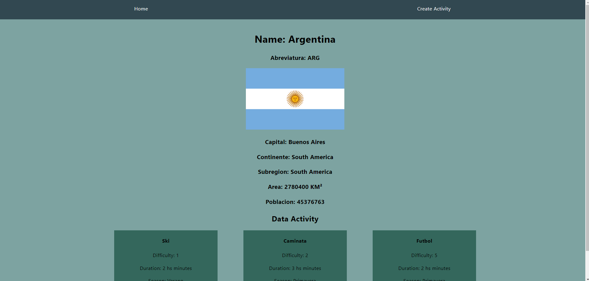
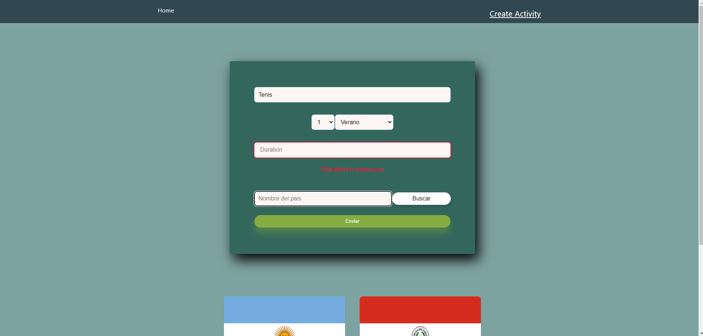

<p align='left'>
    
</p>

# Countries-App

Esto es un proyecto académico que hice como parte de nuestra educación en [Soy Henry](https://www.soyhenry.com/), que consistió en crear una full-stack React application desde cero.

<p align="left">
  
</p>

## Tecnologías usadas

- Front End:
    + HTML - CSS - Javascript
    + React
    + Redux

- Back End:
    + Node.js
    + Express
    + Sequelize

- Database: 
    + PostgreSQL


# Como iniciar el proyecto

 - Clonar el repositorio en su computadora
 - Tener instalado [Node](https://nodejs.org/es/), [NPM](https://www.npmjs.com/) y [PostgreSQL](https://www.postgresql.org/)
 - En `api` crear un archivo llamado: `.env` que tenga la siguiente forma:

```
DB_USER=usuariodepostgres
DB_PASSWORD=passwordDePostgres
DB_HOST=localhost

```
- Reemplazar `usuariodepostgres` y `passwordDePostgres` con tus propias credenciales para conectarte a postgres.
- Crear desde psql una base de datos llamada `countries` con el comando `CREATE DATABASE countries`
- Abrir una consola y cambiar el directorio hacia la carpeta `api` y ejecutar `npm start`
- Abrir una nueva consola y cambiar el directorio hacia la carpeta `client` y ejecutar `npm start`


### Sobre la APP
Es una aplicación en la cual se pueda ver información de  distintos paises utilizando la api externa [restcountries](https://restcountries.com/) y a partir de ella poder, entre otras cosas:

  - Buscar paises
  - Filtrarlos / Ordenarlos
  - Crear actividades turísticas

# Vista previa

### Pagina Landing

<p align="center">
  
</p>

### Pagina Home

<p align="center">
  
</p>

### Pagina Details

<p align="center">
  
</p>

### Pagina Create Activity

<p align="center">
  
</p>
